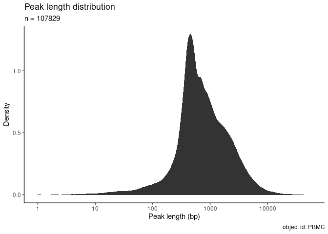
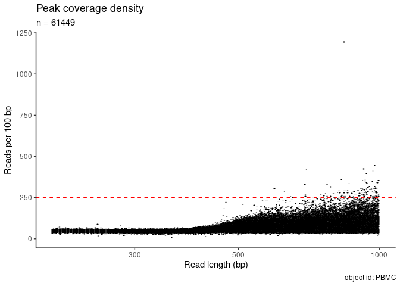
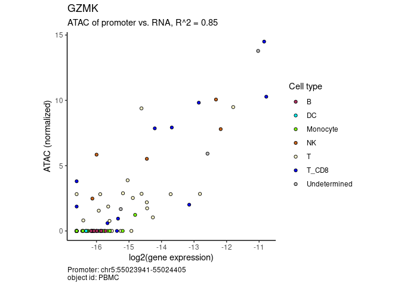
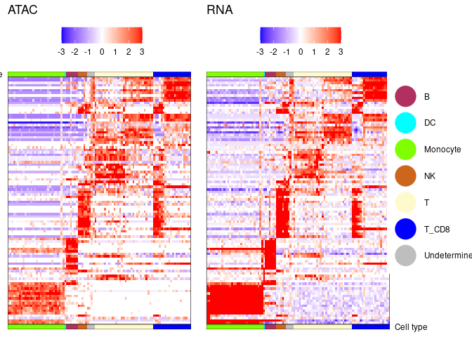

<!-- README.md is generated from README.Rmd. Please edit that file -->

# mcATAC

## Installation

Install the development version of mcATAC:

``` r
remotes::install_github("tanaylab/mcATAC")
```

### Dependencies

You can make sure the dependencies are installed by running:

``` r
mcATAC::check_dependencies()
```

The pacakge assumes that a few standard unix tools are installed and
available at your PATH: `grep`, `awk`, `zcat`, `sed`, `sort`, `head`,
`tail`, `wc`, and `uniq`. In addition, `samtools` should also be
installed. If `tabix` is available some functions would operate faster.

Note that `samtools` and `tabix` are bundled with the cellranger
package, so you can make them available to your PATH by running:

``` r
Sys.setenv(PATH = paste0(Sys.getenv("PATH"), ":", file.path(cell_ranger_path, "external/anaconda/bin")))
```

## Example

``` r
if (!dir.exists("pbmc_data")){
  download_pbmc_example_data()
}
```

### Import ATAC dataset

``` r
atac_sc <- import_from_10x("pbmc_data", genome = "hg38", id = "PBMC", description = "PBMC from a healthy donor - granulocytes removed through cell sorting (10k)")
#> • Importing matrix
#> ℹ Imported a matrix of 11909 cells and 144978 features
#> • Importing features
#> ℹ Removed 107861 ATAC peaks which were all zero
#> ℹ 107861 ATAC peaks
#> ! removed 32 peaks from the following chromosome(s) which are missing from hg38: 'KI270727.1, GL000194.1, GL000205.2, GL000195.1, GL000219.1, KI270734.1, KI270721.1, KI270726.1, KI270713.1'
#> ✔ successfully imported to an ScATACPeaks object with 11909 cells and 107829 ATAC peaks
```

``` r
atac_sc
#> <ScATACPeaks> object with 11909 cells and 107829 ATAC peaks from hg38.
#> id: "PBMC"
#> description: "PBMC from a healthy donor - granulocytes removed through cell
#> sorting (10k)"
#> Loaded from:
#> '/net/mraid14/export/tgdata/users/yonshap/proj/matching/data/filtered_feature_bc_matrix/matrix.mtx'
#> Slots include:
#>   • `@mat`: a numeric matrix where rows are peaks and columns are cells. Can be
#>   a sparse matrix.
#>   • `@peaks`: a misha intervals set with the peak definitions.
#>   • `@genome`: genome assembly of the peaks
```

### Filter peaks by coverage and/or length

Plot the length distribution:

``` r
plot_peak_length_distribution(atac_sc)
```



Plot the coverage distribution:

``` r
plot_peak_coverage_distribution(atac_sc)
```


Filter:

``` r
atac_sc <- filter_features(atac_sc = atac_sc, minimal_max_umi = 3, min_peak_length = 200, max_peak_length = 1000)
#> • 8544 features were shorter than 200bp
#> • 37160 features were longer than 1000bp
#> • 676 features had a maximal UMI count less than 3
#> ✔ Removed 46380 peaks out of 107829 (43%). The object is left with 61449 peaks.
```

Identify outliers using coverage density:

``` r
plot_peak_coverage_density(atac_sc) + geom_hline(yintercept = 250, linetype = "dashed", color = "red")
```



``` r
atac_sc <- filter_features(atac_sc, max_peak_density = 250)
#> • 107 features had a peak density of more than 250 UMIs per 100bp
#> ! Adding to previous ignore policy (46380 peaks).
#> ✔ Removed 107 peaks out of 107829 (0%). The object is left with 61342 peaks (43%).
```

### Project RNA metacells

``` r
data(cell_to_metacell_pbmc_example)
head(cell_to_metacell_pbmc_example)
#> # A tibble: 6 × 2
#>   cell_id            metacell
#>   <chr>                 <int>
#> 1 AAACAGCCAATCCCTT-1       44
#> 2 AAACAGCCAATGCGCT-1       22
#> 3 AAACAGCCACCAACCG-1        7
#> 4 AAACAGCCAGGATAAC-1       24
#> 5 AAACAGCCAGTTTACG-1       32
#> 6 AAACATGCAAGGTCCT-1       30
```

``` r
atac_mc <- project_atac_on_mc(atac_sc, cell_to_metacell_pbmc_example)
#> ℹ 3198 cells (out of 11909) do not have a metacell and have been removed.
#> • Setting egc cell size to 67733 (the 0.1 quantile of metacell sizes)
#> ✔ Created a new McATACPeaks object with 97 metacells and 61342 ATAC peaks.
atac_mc
#> <McATACPeaks> object with 97 metacells and 61342 ATAC peaks from hg38.
#> id: "PBMC"
#> description: "PBMC from a healthy donor - granulocytes removed through cell
#> sorting (10k)"
#> Slots include:
#>   • `@mat`: a numeric matrix where rows are peaks and columns are metacells.
#>   Can be a sparse matrix.
#>   • `@peaks`: a misha intervals set with the peak definitions.
#>   • `@genome`: genome assembly of the peaks
#>   • `@egc`: a numeric matrix which contains normalized metacell accessibility.
#>   • `@fp`: a matrix showing for each peak (row) the relative enrichment of umis
#>   in log2 scale.
```

``` r
atac_mc
#> <McATACPeaks> object with 97 metacells and 61342 ATAC peaks from hg38.
#> id: "PBMC"
#> description: "PBMC from a healthy donor - granulocytes removed through cell
#> sorting (10k)"
#> Slots include:
#>   • `@mat`: a numeric matrix where rows are peaks and columns are metacells.
#>   Can be a sparse matrix.
#>   • `@peaks`: a misha intervals set with the peak definitions.
#>   • `@genome`: genome assembly of the peaks
#>   • `@egc`: a numeric matrix which contains normalized metacell accessibility.
#>   • `@fp`: a matrix showing for each peak (row) the relative enrichment of umis
#>   in log2 scale.
```

### Add metadata

``` r
data(mcmd)
atac_mc <- add_mc_metadata(atac_mc, mcmd)
```

## Import RNA expression data

``` r
data(rna_mc_mat)
atac_mc <- add_mc_rna(atac_mc, rna_mc_mat)
```

``` r
plot_atac_rna(atac_mc, "GZMK")
#> → The gene "GZMK" has 2 alternative promoters.
```



``` r
plot_atac_rna_markers(atac_mc)
#> → removing 7543 genes with no RNA expression in any metacell.
#> → removing 23451 genes with no RNA expression (log2) of above -13 in any metacell.
#> → removing 3534 genes with no fold change (log2) of above 2 in any metacell.
#> ℹ 5191 genes left for consideration.
#> ✔ 100 marker genes selected.
#> ℹ Ordering metacells based on 'CA6' vs 'LYN'
#> ℹ Maintaining metacell order within cell types
#> ✔ marker matrix of 100 genes x 97 metacells created.
#> → Creating ATAC matrix by finding for each marker gene the ATAC peak that is most correlated to it.
```



See more at the
[vignette](https://tanaylab.github.io/mcATAC/articles/mcATAC.html)
