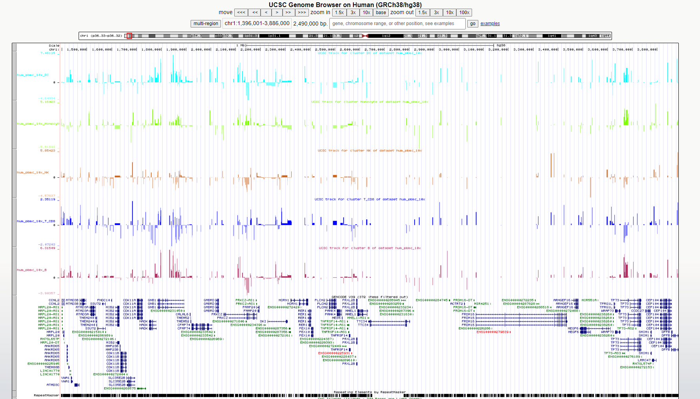

```{r, include = FALSE}
knitr::opts_chunk$set(
  collapse = TRUE,
  dpi = 300,
  comment = "#>"
)
```

```{r setup}
library(mcATAC)
library(ggplot2)
ggplot2::theme_set(ggplot2::theme_classic())
```

## Download dataset

Download the following dataset from 10x: 

[PBMC from a healthy donor - granulocytes removed through cell sorting (10k) (Filtered feature barcode matrix MEX (DIR))](https://support.10xgenomics.com/single-cell-multiome-atac-gex/datasets/1.0.0/pbmc_granulocyte_sorted_10k?)


And extract it's contents to a directory called `pbmc_data`:

```{r download-data}
if (!dir.exists("pbmc_data")){
  download_pbmc_example_data()
}
```

## Import ATAC dataset

```{r import}
atac_sc <- import_from_10x("pbmc_data", genome = "hg38", id = "pbmc", description = "PBMC from a healthy donor - granulocytes removed through cell sorting (10k)")
atac_sc
```

## Filter peaks 

### by coverage and/or length

Plot the length distribution:

```{r plot-peak-len}
plot_peak_length_distribution(atac_sc)
```

Plot the coverage distribution:

```{r plot-peak-cov}
plot_peak_coverage_distribution(atac_sc)
```

Plot the distribution of the maximal number of peaks per cell for each peak:

```{r plot-peak-max-cov}
plot_peak_max_cov_distribution(atac_sc)
```

Filter the peaks by length and coverage:

```{r filter-peaks}
atac_sc <- filter_features(atac_sc, minimal_max_umi = 3, min_peak_length = 200, max_peak_length = 1000)
```

Identify outliers using coverage density: 

```{r plot-peak-density}
plot_peak_coverage_density(atac_sc) + geom_hline(yintercept = 250, linetype = "dashed", color = "red")
```

```{r filter-peaks-cov-density}
atac_sc <- filter_features(atac_sc, max_peak_density = 250)
```

### by overlap with known blacklist regions 

```{r filter-peaks-blacklist}
blacklist_overlaps <- find_blacklist_overlaps(atac_sc)
atac_sc <- atac_ignore_peaks(atac_sc, blacklist_overlaps, reset = FALSE)
```

> See [https://doi.org/10.1038/s41598-019-45839-z]

## Project RNA metacells 

```{r project}
data(cell_to_metacell_pbmc_example)
head(cell_to_metacell_pbmc_example)
atac_mc <- project_atac_on_mc(atac_sc, cell_to_metacell_pbmc_example)
atac_mc
```

Or using a metacell1 object: 
```{r project-mc1, eval = FALSE}
atac_mc <- project_atac_on_mc_from_metacell1(atac_sc, "pbmc_data/scdb", "rna")
```
## Import annotations
```{r import-annotations}
data(mcmd)
atac_mc <- add_mc_metadata(atac_mc, mcmd)
```
## Identify dynamic peaks
```{r dynamic-peaks, dpi=300, fig.width=7, fig.height=7}
dyn_peaks <- identify_dynamic_peaks(mcatac = atac_mc, mean_thresh_q = 0.05)
```

## Cluster a peak set
```{r cluster-peaks}
peak_clust <- gen_atac_peak_clust(atac_mc, k = 30)
table(peak_clust)
```

## Plot peaks clustering 

```{r plot-atac-peak-map}
plot_atac_peak_map(atac_mc, atac_mc@metadata$cell_type, peak_clust)
```

## Export dynamic peaks to UCSC tracks
```{r export-to-ucsc}
outdir <- tempdir()
export_atac_clust_ucsc(mc_atac = atac_mc, track_prefix = 'hum_pbmc_10x', normalization = 'lfcom', output_dir = outdir)
```




## Add expression data 

```{r add-rna}
data(rna_mc_mat)
atac_mc <- add_mc_rna(atac_mc, rna_mc_mat)
```

## Plot accesability vs expression 

Between a gene and its promoter:

```{r atac-rna-scatter-1}
plot_atac_rna(atac_mc, "CD4")
```

Between a gene and a promoter of a different gene: 

```{r atac-rna-scatter-2}
plot_atac_rna(atac_mc, "CD4", "GZMK")
```

Between a gene and an arbitrary peak:

```{r atac-rna-scatter-3}
plot_atac_rna(atac_mc, "CD4", peak = atac_mc@peaks$peak_name[1])
```

## Plot RNA markers 

```{r rna-markers}
plot_atac_rna_markers(atac_mc)
```

## Export to an h5ad file

```{r export-to-h5ad}
export_to_h5ad(atac_mc, "pbmc_data/atac_mc.h5ad", compression = "gzip")
# Load using: atac_mc <- import_from_h5ad("pbmc_data/atac_mc.h5ad")
```

## Make per-metacell BAMs, WIGs and tracks

```{r bams-wigs-tracks}
bam_path <- "path/to/filtered_feature_barcode_matrix" ## if using 10X data
bam_output_folder <- "./my_mc_bams/"
c2mc_folder <- "./c2mc/"
wig_folder <- "./wig_output"
track_name_prefix = "My_scATAC_project"
generate_per_metacell_bams(bam_path = bam_path, mcatac = atac_mc, out_dir = bam_output_folder, c2mc_path = c2mc_folder)
generate_wigs_from_bams(bam_folder_path = bam_output_folder, track_name_prefix = track_name_prefix, output_path = wig_folder, parallel = TRUE)
convert_wigs_to_tracks(wig_folder, track_name_prefix = track_name_prefix, description = NULL, parallel = TRUE, force = FALSE)
```

## Make pseudo-bulk ATAC tracks from per-metacell tracks

```{r merge-bams}
bam_output_folder <- "./my_mc_bams/"
track_name_prefix = "My_scATAC_project"
cell_type = "Neuron"
mcmd = readr::read_csv("./data/mcmd.csv") ## metacell metadata
merge_metacell_bams(bam_path = bam_output_folder, output_filename="./pseudo_bulk.bam", mcs = which(mcmd$cell_type == cell_type), parallel = T)
bam_to_wig(bam_path = "./pseudo_bulk.bam", output_filename = "./pseudo_bulk.wig", track_name_prefix = track_name_prefix)
make_one_track(fp = "./pseudo_bulk.wig", track_name_prefix = track_name_prefix, description = glue::glue("Pseudo-bulk track of ATAC signal from {cell_type} cells"))
## Get available motif PSSM datasets and extract motif energies

```{r motifs}
gset_genome("hg38")
available_datasets <- get_available_pssms(return_datasets_only = TRUE)
available_datasets
sample_peaks <- sample_n(mc_atac@peaks, 1e+4)
motif_mat = generate_motif_pssm_matrix(peak_set = sample_peaks, motif_regex = c("Bcl", "Atf"), datasets_of_interest = "jaspar", parallel = T)
head(motif_mat)
```

## Extract motif energies from random genomic background

```{r random_genome}
gset_genome("hg38")
rg = gen_random_genome_peak_motif_matrix(num_peaks = 1e+4,
                                          bp_from_chrom_edge_to_avoid = 1e+6, 
                                          motif_regex = c("Bcl", "Atf"),
                                          datasets_of_interest = "jaspar", 
                                          parallel = T)
head(rg)
```

## Compare Kolmogorov-Smirnov statistics on distribution of motif energies between peaks of interest and genomic background

```{r ks_d}
gset_genome("hg38")
## all peaks
ks_all <- calculate_d_stats(motif_mat, rg, parallel = TRUE, alternative = "less", nc = parallel::detectCores())  

## by peak cluster
sample_mc <- subset_peaks(atac_mc = atac_mc, sample_peaks)  
sample_peak_clustering <- gen_atac_peak_clust(atac_mc = sample_mc, k = 10)  
ks_mat <- calculate_d_stats(motif_mat, rg, parallel = TRUE, fg_clustering = sample_peak_clustering, alternative = "less", nc = parallel::detectCores())  
head(ks_mat)  
```